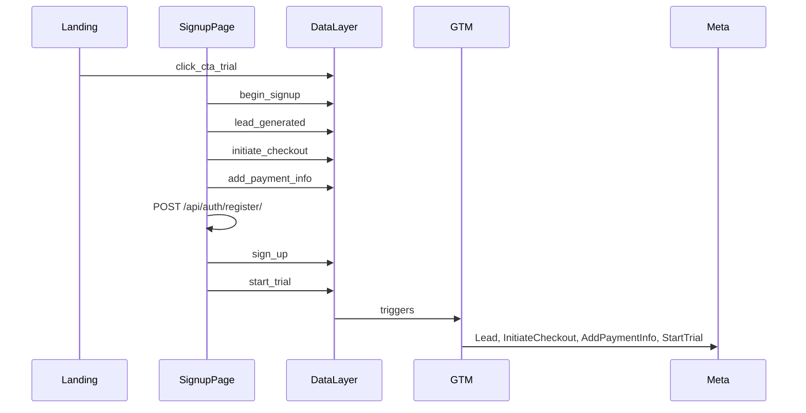

# Funil de conversão — dataLayer e GTM (MarketChat)

O frontend React **não** chama Meta Pixel (`fbq`) nem GA4 (`gtag`) diretamente. Todos os eventos passam por `window.dataLayer.push` via [`front-end/src/utils/analytics.ts`](../front-end/src/utils/analytics.ts). Tags Meta Pixel e GA4 devem ser configuradas **no Google Tag Manager**.

Purchase (pagamento confirmado) é enviado **server-side** via Meta Conversions API (Django + webhook Asaas) — não mapear Purchase no GTM a partir do browser.

---

## Fluxo do cadastro trial



---

## Tabela de eventos (dataLayer → Meta / GA4)

| Ordem | Evento dataLayer | Quando dispara (React) | Arquivo | Meta Pixel | GA4 |
|-------|------------------|------------------------|---------|------------|-----|
| 1 | `click_cta_trial` | Clique em "Teste grátis" na landing | `MarketingCtaLink.tsx` | — (custom ou não enviar) | `click_cta_trial` |
| 2 | `begin_signup` | Montagem de `/auth/signup` | `SignupPage.tsx` | **Não** StartTrial | `begin_checkout` ou custom |
| 3 | `lead_generated` | Passo 1 validado → Continuar | `SignupPage.tsx` | **Lead** | `generate_lead` |
| 4 | `initiate_checkout` | Passo 3 montado (tela do cartão) | `SignupPage.tsx` | **InitiateCheckout** | `begin_checkout` + `ecommerce` |
| 5 | `add_payment_info` | Clique em pagar, **antes** do POST | `SignupPage.tsx` | **AddPaymentInfo** | `add_payment_info` + `ecommerce` |
| 6 | `sign_up` | POST `/api/auth/register/` OK | `SignupPage.tsx` | CompleteRegistration (opcional) | `sign_up` |
| 7 | **`start_trial`** | POST `/api/auth/register/` OK | `SignupPage.tsx` | **StartTrial** (browser) | evento custom `start_trial` |
| 7b | *(server)* | POST `/api/auth/register/` OK | `registration.py` → `FacebookCAPI` | **StartTrial** (CAPI) | dedupe via `event_id`: `start_trial_tenant_{id}` |
| — | *(server)* | Webhook Asaas pagamento | Django CAPI | **Purchase** | — |

---

## Regras críticas para tráfego (Meta Ads)

### StartTrial — único gatilho correto

No GTM, a tag Meta **StartTrial** deve usar trigger:

- **Custom Event:** `start_trial` (nome exato, snake_case)

**Não** mapear StartTrial para:

- `begin_signup` (dispara ao abrir a página de cadastro)
- `click_cta_trial` (dispara ao clicar no CTA da landing)
- `lead_generated` (dispara ao fim do Passo 1)
- Page View de `/auth/signup` ou `/signup`
- All Pages

Se StartTrial aparece cedo no Events Manager, o problema está no **GTM**, não no React. Validar no DevTools:

```javascript
window.dataLayer.filter(e => e.event === 'start_trial')
```

Esse push só deve existir **depois** de cadastro bem-sucedido.

O backend também envia **StartTrial** via CAPI ([`facebook_capi.py`](../apps/billing/services/facebook_capi.py)) após cadastro OK, com `event_id` fixo por tenant. Use o mesmo `event_id` no GTM (opcional) para deduplicação browser + server.

### Payloads com e-commerce (Passo 3)

Eventos `initiate_checkout` e `add_payment_info` incluem:

```javascript
{
  event: "initiate_checkout", // ou add_payment_info
  ecommerce: {
    currency: "BRL",
    value: 59.90,
    items: [{
      item_id: "marketchat_monthly",
      item_name: "MarketChat — Assinatura mensal",
      price: 59.90,
      quantity: 1
    }]
  },
  user_data: {
    email_address: "<sha256>",
    phone_number: "<sha256>"
  }
}
```

Montados por `buildSignupFunnelPayload()` em `analytics.ts`. No GTM, mapear `ecommerce.value` e `ecommerce.currency` para as tags Meta.

### start_trial — payload

```javascript
{
  event: "start_trial",
  currency: "BRL",
  value: 59.90,
  hashed_email: "<sha256>",
  hashed_phone: "<sha256>"
}
```

Sem PII em claro. Advanced Matching no GTM usa os hashes.

---

## Consentimento (LGPD)

- GTM só carrega após consentimento de marketing (`enableMarketingTracking()`).
- Consent Mode v2: `consent_default` / `consent_granted` no dataLayer antes das tags.
- No host do app (`app.*`), analytics também pode ser aceito — ver `canTrackEvents()` em `analytics.ts`.

---

## Constantes de referência

Definidas em [`front-end/src/constants/analyticsEvents.ts`](../front-end/src/constants/analyticsEvents.ts):

| Constante | Valor dataLayer |
|-----------|-----------------|
| `CLICK_CTA_TRIAL` | `click_cta_trial` |
| `BEGIN_SIGNUP` | `begin_signup` |
| `LEAD_GENERATED` | `lead_generated` |
| `INITIATE_CHECKOUT` | `initiate_checkout` |
| `ADD_PAYMENT_INFO` | `add_payment_info` |
| `SIGN_UP` | `sign_up` |
| `START_TRIAL` | `start_trial` |

---

## Checklist GTM (configuração manual)

- [ ] Trigger Meta StartTrial → Custom Event `start_trial` apenas
- [ ] Trigger Meta Lead → Custom Event `lead_generated`
- [ ] Trigger Meta InitiateCheckout → Custom Event `initiate_checkout`
- [ ] Trigger Meta AddPaymentInfo → Custom Event `add_payment_info`
- [ ] Tag GA4 mapeia `ecommerce` do dataLayer nos eventos de checkout
- [ ] Nenhuma tag Meta Purchase no browser (CAPI no backend)
- [ ] Preview GTM: percorrer cadastro e confirmar ordem dos eventos no dataLayer

---

## Debug rápido

1. Aceitar cookies de marketing.
2. Abrir DevTools → Console.
3. Durante o cadastro:

```javascript
// Ver todos os eventos de funil
window.dataLayer.filter(e =>
  ['click_cta_trial','begin_signup','lead_generated','initiate_checkout',
   'add_payment_info','sign_up','start_trial'].includes(e.event)
)
```

4. `start_trial` deve ser o **último** da lista e só após resposta OK do register.
