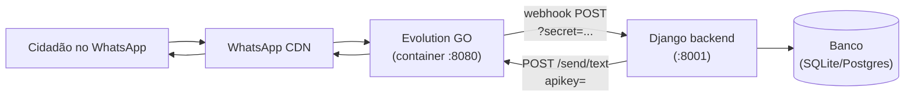
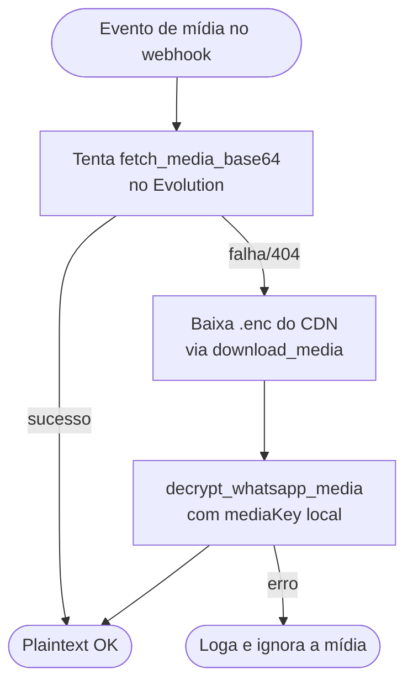

# Integrando Evolution GO com Django

> Guia prático e reaproveitável para conectar uma aplicação Django ao
> [Evolution GO](https://github.com/evolution-foundation/evolution-go) (gateway
> WhatsApp em Go). Cobre provisionamento de instâncias, webhook reverso, envio
> de mensagens, mídia E2E e armadilhas que custaram dias de debug em produção.
>
> Para portar a **plataforma completa** (Django + painel React + inbox/handover,
> sem regras de micromercado), veja também
> [`whatsapp-bot-platform-playbook.md`](./whatsapp-bot-platform-playbook.md).

Última revisão: maio/2026 — derivado da implementação do projeto
`talkpref`.

---

## Sumário

1. [Visão geral da arquitetura](#1-visão-geral-da-arquitetura)
2. [Pré-requisitos](#2-pré-requisitos)
3. [Variáveis de ambiente](#3-variáveis-de-ambiente)
4. [Modelo Django para a instância](#4-modelo-django-para-a-instância)
5. [Cliente HTTP do Evolution](#5-cliente-http-do-evolution)
6. [Provisionando uma instância (passo a passo)](#6-provisionando-uma-instância-passo-a-passo)
7. [Webhook reverso (Evolution → Django)](#7-webhook-reverso-evolution--django)
8. [Enviando mensagens (Django → WhatsApp)](#8-enviando-mensagens-django--whatsapp)
9. [Mídia E2E: download e decifragem](#9-mídia-e2e-download-e-decifragem)
10. [QR code e estado de conexão](#10-qr-code-e-estado-de-conexão)
11. [Multi-tenant e isolamento](#11-multi-tenant-e-isolamento)
12. [Armadilhas conhecidas](#12-armadilhas-conhecidas)
13. [Checklist de produção](#13-checklist-de-produção)
14. [Apêndice — diferenças entre Evolution GO e Evolution API (Node)](#14-apêndice--diferenças-entre-evolution-go-e-evolution-api-node)

---

## 1. Visão geral da arquitetura



Componentes:

- **Evolution GO**: gateway que mantém a sessão WhatsApp (uma por *instância*),
  recebe mensagens da Meta e dispara webhook para o Django.
- **Django**: armazena instâncias por cliente (multi-tenant), processa o
  webhook, persiste a mensagem e responde via API do Evolution.
- **Webhook secret**: como o Evolution GO **não envia headers customizados**,
  o segredo de autenticação vai na própria URL como `?secret=...`.

### Dois fluxos críticos

1. **Inbound**: Evolution recebe a mensagem → POST no webhook do Django →
   parser → orchestrator (negócio) → resposta opcional via `send_text`.
2. **Outbound**: Django chama `POST /send/text` no Evolution → Evolution
   entrega via WhatsApp.

---

## 2. Pré-requisitos

- **Docker** + **Docker Compose** (Evolution GO roda em container).
- **Python 3.11+** com `cryptography` (necessário para decifrar mídia E2E).
- **Django 5.x** + **Django REST Framework** (o exemplo usa, mas o cliente é
  agnóstico).
- Acesso pública (ou *tunnel*: ngrok/cloudflared) à URL do webhook do Django,
  quando rodar Evolution em outro host.

### `docker-compose.yml` mínimo para Evolution GO

```yaml
services:
  evolution-go:
    image: ghcr.io/evolution-foundation/evolution-go:latest
    container_name: evolution-go
    restart: unless-stopped
    ports:
      - "8080:8080"
    environment:
      AUTHENTICATION_API_KEY: bIf9vTxSeSXwdTlV6SD6ZfNOCNEHPLf8AwQMw7loAcI=
      WEBHOOK_GLOBAL_URL: ""
      WEBHOOK_GLOBAL_ENABLED: "false"
      WEBHOOK_FILES: "true"
      LOG_LEVEL: "info"
    volumes:
      - evolution_data:/data
    extra_hosts:
      - "host.docker.internal:host-gateway"

volumes:
  evolution_data:
```

> **`extra_hosts`**: necessário em Linux para o container alcançar o Django
> rodando no host como `http://host.docker.internal:8001`. Em macOS o
> Docker Desktop já injeta isso.

---

## 3. Variáveis de ambiente

No `settings.py` (ou em um `local.py` para dev):

```python
EVOLUTION_API_BASE_URL = "http://localhost:8080"
EVOLUTION_GLOBAL_API_KEY = "<AUTHENTICATION_API_KEY do compose>"

PUBLIC_WEBHOOK_BASE_URL = "http://host.docker.internal:8001"

EVOLUTION_WEBHOOK_EVENTS = ["MESSAGE", "CONNECTION", "QRCODE"]

WEBHOOK_SHARED_SECRET = ""
```

Observações:

- `EVOLUTION_GLOBAL_API_KEY` é a chave **administrativa** (criar/listar/deletar
  instâncias). Não confundir com a `apikey` *por instância* (token gerado no
  provisionamento e gravado em `WhatsappInstance.api_key`).
- `PUBLIC_WEBHOOK_BASE_URL` precisa ser alcançável **a partir do container do
  Evolution**. Em Linux, configure `extra_hosts` no compose e use
  `host.docker.internal`. Em produção, use a URL pública real (com HTTPS).
- Mudou `PUBLIC_WEBHOOK_BASE_URL`? Re-provisione a instância — o Evolution
  persiste a `webhookUrl` do lado dele e não atualiza sozinho.

---

## 4. Modelo Django para a instância

Multi-tenant: cada cliente tem 1+ instâncias. Use índice único em
`(company, instance_name)` para evitar colisões.

```python
from django.db import models

class WhatsappInstance(models.Model):
    company = models.ForeignKey("core.Company", on_delete=models.CASCADE)
    instance_name = models.CharField(max_length=255)
    instance_id = models.CharField(max_length=64, blank=True, default="")
    api_key = models.CharField(max_length=512, blank=True, default="")
    webhook_url = models.URLField(max_length=2048, blank=True, default="")
    webhook_secret = models.CharField(max_length=255, blank=True, default="")
    pair_phone = models.CharField(max_length=32, blank=True, default="")
    is_active = models.BooleanField(default=True)

    class Meta:
        constraints = [
            models.UniqueConstraint(
                fields=("company", "instance_name"),
                name="uniq_whatsappinstance_company_instance_name",
            ),
        ]
        indexes = [models.Index(fields=["company", "instance_name"])]
```

Campos críticos:

| Campo | Origem | Uso |
|---|---|---|
| `instance_name` | escolha local; vira ID lógico no Evolution | header `apikey` por instância nas rotas `/instance/*` é o `api_key`; o `instance_name` aparece em logs do Evolution e em alguns paths |
| `instance_id` | UUID que **você gera** e envia no `POST /instance/create` | usado em `DELETE /instance/delete/{id}` |
| `api_key` | `token` que **você gera** e envia no `POST /instance/create` | é a `apikey` por instância — header em **todas** as rotas exceto admin |
| `webhook_secret` | aleatório por instância (`secrets.token_urlsafe(32)`) | embutido na URL do webhook como `?secret=...` |
| `pair_phone` | opcional; DDI + número só com dígitos | enviado em `POST /instance/connect` para emitir QR vinculado a esse aparelho |

> **Importante**: armazene `api_key` com cuidado (cofre/Secrets Manager em
> produção). Se vazar, o atacante pode enviar mensagens em nome do tenant.

---

## 5. Cliente HTTP do Evolution

Wrapper enxuto sobre `urllib`, sem dependências extras. Esqueleto reutilizável:

```python
# apps/whatsapp/services/evolution_client.py
import json
import logging
import urllib.error
import urllib.parse
import urllib.request
from typing import Any, Iterable

from django.conf import settings

logger = logging.getLogger(__name__)


class EvolutionClient:
    """Cliente para Evolution GO. Não confundir com Evolution API (Node)."""

    DEFAULT_EVENTS = ("MESSAGE", "CONNECTION", "QRCODE")

    def __init__(self, base_url: str | None = None, global_api_key: str | None = None):
        self.base_url = (
            base_url or getattr(settings, "EVOLUTION_API_BASE_URL", "") or ""
        ).rstrip("/")
        self.global_api_key = (
            global_api_key
            if global_api_key is not None
            else getattr(settings, "EVOLUTION_GLOBAL_API_KEY", "") or ""
        )

    def _request(self, method, path, *, apikey, body=None, timeout=30):
        if not self.base_url:
            raise RuntimeError("EVOLUTION_API_BASE_URL não configurado.")
        url = f"{self.base_url}{path}"
        data = json.dumps(body).encode("utf-8") if body is not None else None
        headers = {"apikey": apikey} if apikey else {}
        if data is not None:
            headers["Content-Type"] = "application/json"
        req = urllib.request.Request(url, data=data, method=method, headers=headers)
        try:
            with urllib.request.urlopen(req, timeout=timeout) as resp:
                raw = resp.read().decode("utf-8")
                return json.loads(raw) if raw else {}
        except urllib.error.HTTPError as e:
            body_bytes = b""
            try:
                body_bytes = e.read()
            except Exception:
                pass
            level = logging.WARNING if 400 <= e.code < 500 else logging.ERROR
            logger.log(level, "Evolution HTTP %s em %s %s: %r",
                       e.code, method, path, body_bytes[:500])
            e._body_preview = body_bytes  # cache para o caller
            raise
```

> O snippet acima é o coração do cliente. As demais operações
> (`create_instance`, `connect_instance`, `send_text`, etc.) são chamadas
> a este `_request` com o `path`, `apikey` e `body` corretos.

Por que tratar 4xx como `WARNING` em vez de `ERROR`:

- "session already logged in" (400) acontece toda vez que o QR é pedido
  para uma sessão já conectada — não é bug, é estado normal.
- "instance not found" (404) acontece quando o seu DB e o Evolution
  divergiram (ex.: instância apagada manualmente do container).

Loggar isso como `ERROR` polui o `sentry`/observabilidade.

---

## 6. Provisionando uma instância (passo a passo)

Fluxo: `POST /instance/create` → `POST /instance/connect` (configura webhook
**e** inicia a sessão; o Evolution emite QR) → salva localmente.

### 6.1 `create_instance`

```python
def create_instance(self, *, name: str, instance_id: str, token: str):
    """POST /instance/create — cria o registro no Evolution GO.

    - `token` é OBRIGATÓRIO e vira a apikey da instância.
    - `instance_id` é OBRIGATÓRIO; aparece em rotas como /instance/delete/{id}.
    """
    return self._request(
        "POST",
        "/instance/create",
        apikey=self.global_api_key,
        body={"name": name, "instanceId": instance_id, "token": token},
    )
```

### 6.2 `connect_instance`

```python
def connect_instance(self, *, instance_api_key, webhook_url, events=None,
                     phone: str = "", immediate: bool = False):
    """POST /instance/connect — registra webhook + inicia sessão.

    Diferente do Evolution API Node, NÃO existe /webhook/set/{name}.
    O webhook é setado aqui no `webhookUrl`.
    """
    body = {
        "webhookUrl": webhook_url,
        "subscribe": list(events) if events else list(self.DEFAULT_EVENTS),
        "websocketEnable": "false",
        "natsEnable": "false",
        "rabbitmqEnable": "false",
        "immediate": immediate,
    }
    if phone:
        body["phone"] = phone
    return self._request(
        "POST", "/instance/connect", apikey=instance_api_key, body=body
    )
```

### 6.3 Construindo a URL pública do webhook (com secret)

Como o Evolution GO não envia headers customizados, o segredo **vai na URL**:

```python
@staticmethod
def build_webhook_url(base_url: str, secret: str | None = None) -> str:
    if not base_url:
        return ""
    if not secret:
        return base_url
    sep = "&" if "?" in base_url else "?"
    return f"{base_url}{sep}secret={urllib.parse.quote(secret)}"
```

Exemplo: `http://host.docker.internal:8001/api/v1/webhooks/evolution/?secret=abc123`.

### 6.4 Endpoint Django de provisionamento

```python
import secrets, uuid
from rest_framework.decorators import action
from rest_framework.response import Response

@action(detail=False, methods=["post"], url_path="provision")
def provision(self, request):
    instance_name = request.data["instance_name"]
    company = request.user.company

    webhook_base = f"{settings.PUBLIC_WEBHOOK_BASE_URL}/api/v1/webhooks/evolution/"
    webhook_secret = secrets.token_urlsafe(32)
    webhook_url = EvolutionClient.build_webhook_url(webhook_base, webhook_secret)

    instance_id = str(uuid.uuid4())
    token = secrets.token_urlsafe(32)

    client = EvolutionClient()
    create_payload = client.create_instance(
        name=instance_name, instance_id=instance_id, token=token
    )
    connect_payload = client.connect_instance(
        instance_api_key=token, webhook_url=webhook_url
    )

    WhatsappInstance.objects.create(
        company=company,
        instance_name=instance_name,
        instance_id=instance_id,
        api_key=token,
        webhook_url=webhook_url,
        webhook_secret=webhook_secret,
        is_active=True,
    )

    qrcode = client.fetch_qrcode(instance_api_key=token)
    return Response(
        {"create": create_payload, "connect": connect_payload, "qrcode": qrcode}
    )
```

**Cuidados**:

- Use `transaction.atomic()` para que falhas após o `create_instance` no
  Evolution não deixem registro local órfão. Se o `connect_instance` falhar,
  considere chamar `client.delete_instance(instance_id=...)` para rollback no
  lado do Evolution.
- Tratamento de `urllib.error.HTTPError`: leia `e._body_preview` (cache) ou
  `e.read()` para ter o JSON de erro do Evolution.

---

## 7. Webhook reverso (Evolution → Django)

### 7.1 Roteamento

```python
# apps/whatsapp/webhooks/urls.py
from django.urls import path
from .views import EvolutionWebhookView

urlpatterns = [
    path("evolution/", EvolutionWebhookView.as_view(), name="webhook-evolution"),
]
```

### 7.2 View (CSRF-exempt, sem autenticação DRF)

```python
from django.utils.decorators import method_decorator
from django.views.decorators.csrf import csrf_exempt
from rest_framework import status
from rest_framework.views import APIView
from rest_framework.response import Response

@method_decorator(csrf_exempt, name="dispatch")
class EvolutionWebhookView(APIView):
    authentication_classes = []
    permission_classes = []

    def post(self, request):
        body = request.data if isinstance(request.data, dict) else {}
        event = parse_evolution_payload(body)
        if not event:
            return Response({"ok": True, "ignored": True})

        if event.from_me or "@g.us" in event.wa_id:
            return Response({"ok": True})

        instance = WhatsappInstance.objects.filter(
            instance_name=event.instance_key, is_active=True
        ).first() or WhatsappInstance.objects.filter(
            instance_id=event.instance_key, is_active=True
        ).first()
        if not instance:
            return Response({"error": "unknown instance"}, status=404)

        if not self._allowed(request, instance):
            return Response({"error": "forbidden"}, status=403)

        try:
            self._handle(event, instance)
        except Exception:
            logger.exception("Erro processando webhook")
            return Response({"error": "internal"}, status=500)

        return Response({"ok": True})

    def _allowed(self, request, instance):
        secret = (
            request.headers.get("X-Webhook-Secret")
            or request.query_params.get("secret")
        )
        if instance.webhook_secret:
            return bool(secret) and secret == instance.webhook_secret
        global_secret = getattr(settings, "WEBHOOK_SHARED_SECRET", "") or ""
        if global_secret:
            return bool(secret) and secret == global_secret
        return bool(settings.DEBUG)
```

### 7.3 Parsing — dois dialetos no mesmo gateway

O Evolution GO usa **CamelCase** (`data.Info.Chat`, `data.Message.conversation`),
mas algumas builds mais antigas (forks do Node) usam camelCase
(`data.key.remoteJid`, `data.message.conversation`). Aceite ambos:

```python
def _ci_get(d, *names):
    """Case-insensitive lookup; Evolution GO mistura CamelCase e camelCase."""
    if not isinstance(d, dict):
        return None
    for name in names:
        if name in d:
            return d[name]
    lowered = {k.lower(): k for k in d.keys() if isinstance(k, str)}
    for name in names:
        key = lowered.get(name.lower())
        if key is not None:
            return d[key]
    return None


def _extract_message_meta(data):
    """Devolve (remote_jid, message_id, from_me)."""
    info = _ci_get(data, "Info") or _ci_get(data, "info")
    if isinstance(info, dict):
        remote = _ci_get(info, "Chat") or _ci_get(info, "RemoteJid") or ""
        msg_id = _ci_get(info, "ID") or _ci_get(info, "Id") or ""
        from_me = bool(_ci_get(info, "IsFromMe") or _ci_get(info, "fromMe"))
        if remote and msg_id:
            return remote, msg_id, from_me

    key = _ci_get(data, "key") or {}
    if isinstance(key, dict):
        remote = _ci_get(key, "remoteJid") or ""
        msg_id = _ci_get(key, "id") or ""
        from_me = bool(_ci_get(key, "fromMe"))
        return remote, msg_id, from_me
    return "", "", False
```

### 7.4 Mensagens vêm em wrappers (view-once, ephemeral, edited)

Antes de ler `conversation` ou `imageMessage`, **desaninhe** os wrappers:

```python
_WRAPPER_KEYS = (
    "viewOnceMessage", "viewOnceMessageV2",
    "ephemeralMessage",
    "documentWithCaptionMessage",
    "editedMessage",
)

def _unwrap_inner_message(message):
    cur = message
    for _ in range(8):
        next_inner = None
        for wrap_key in _WRAPPER_KEYS:
            wrapper = _ci_get(cur, wrap_key)
            if isinstance(wrapper, dict):
                inner = _ci_get(wrapper, "message", "Message")
                if isinstance(inner, dict) and inner:
                    next_inner = inner
                    break
        if next_inner is None:
            break
        cur = next_inner
    return cur
```

> Sem isso, mensagens "view once" e mídias com legenda chegam ao
> orquestrador como `text` vazio. Foi um dos bugs mais difíceis de
> diagnosticar em produção.

---

## 8. Enviando mensagens (Django → WhatsApp)

```python
def send_text(self, instance_api_key, number, text, delay_ms=0):
    return self._request(
        "POST",
        "/send/text",
        apikey=instance_api_key,
        body={"number": number, "text": text, "delay": delay_ms},
    )
```

Uso:

```python
client = EvolutionClient()
client.send_text(
    instance_api_key=instance.api_key,
    number="5511999999999",
    text="Olá! Recebemos sua mensagem."
)
```

**Ritmo para envio em massa** (`BroadcastService` no projeto):
respeite um delay médio de 1.5s entre mensagens, com jitter de 0.5s.
Valores menores aumentam o risco de bloqueio pela Meta.

---

## 9. Mídia E2E: download e decifragem

A parte mais complexa da integração. **Leia esta seção inteira antes
de implementar áudio/imagem/documento.**

### 9.1 Como o WhatsApp criptografa anexos

Cada mensagem com mídia carrega:

- `url` / `directPath`: URL no CDN da Meta com o arquivo `.enc` (ciphertext).
- `mediaKey`: 32 bytes (base64) — chave da mensagem.
- `mimetype`, `fileEncSha256`, `fileSha256`.

O `.enc` é `AES-CBC(ciphertext) + HMAC-SHA256(mac)[0:10]`. Para decifrar:

```
expanded = HKDF-SHA256(mediaKey, info=<label>, L=112)
iv          = expanded[0:16]
cipher_key  = expanded[16:48]
mac_key     = expanded[48:80]
```

Os `<label>` por tipo (definidos pela Meta):

| Tipo | Label |
|---|---|
| audio | `b"WhatsApp Audio Keys"` |
| image | `b"WhatsApp Image Keys"` |
| video | `b"WhatsApp Video Keys"` |
| document | `b"WhatsApp Document Keys"` |

### 9.2 Função de decifragem reutilizável

```python
# apps/whatsapp/services/media_decrypt.py
from cryptography.hazmat.primitives import hashes
from cryptography.hazmat.primitives.ciphers import Cipher, algorithms, modes
from cryptography.hazmat.primitives.kdf.hkdf import HKDF

_HKDF_INFO = {
    "audio": b"WhatsApp Audio Keys",
    "image": b"WhatsApp Image Keys",
    "video": b"WhatsApp Video Keys",
    "document": b"WhatsApp Document Keys",
}

def decrypt_whatsapp_media(*, encrypted_bytes, media_key, media_type):
    info = _HKDF_INFO[media_type]
    key_bytes = _coerce_media_key(media_key)  # aceita bytes, hex, base64

    expanded = HKDF(
        algorithm=hashes.SHA256(),
        length=112,
        salt=None,  # cryptography usa zeros[32] como salt default
        info=info,
    ).derive(key_bytes)

    iv = expanded[0:16]
    cipher_key = expanded[16:48]

    file_data = encrypted_bytes[:-10]  # remove MAC truncado
    cipher = Cipher(algorithms.AES(cipher_key), modes.CBC(iv))
    decryptor = cipher.decryptor()
    decrypted = decryptor.update(file_data) + decryptor.finalize()
    return _pkcs7_unpad(decrypted)
```

### 9.3 Atalho — pedir ao Evolution que decifre

Em algumas builds o Evolution GO expõe uma rota que faz o download e a
decifragem do lado dele, retornando base64 limpo. **Tente esta rota primeiro**;
se falhar, faça localmente como fallback.

```python
def fetch_media_base64(self, *, instance_api_key, instance_name, message_id,
                      remote_jid="", from_me=False, convert_to_mp4=False):
    candidate_paths = [
        f"/chat/getBase64FromMediaMessage/{instance_name}",
        f"/message/downloadMedia/{instance_name}",
        "/chat/getBase64FromMediaMessage",
        "/message/downloadMedia",
    ]
    body = {
        "message": {"key": {"id": message_id, "remoteJid": remote_jid,
                            "fromMe": from_me}},
        "messageId": message_id,
        "convertToMp4": convert_to_mp4,
    }
    for path in candidate_paths:
        try:
            payload = self._request("POST", path, apikey=instance_api_key,
                                    body=body)
        except urllib.error.HTTPError as e:
            if e.code in (401, 403):
                return "", ""
            continue
        b64, mime = _extract_base64_from_payload(payload)
        if b64:
            return b64, mime
    return "", ""
```

### 9.4 Fluxo recomendado (orquestrador)



### 9.5 Detectando o formato real do áudio

Mesmo após decifrar, o `mimetype` que veio no payload pode mentir
(`application/octet-stream`). Use *magic bytes*:

```python
def sniff_audio_format(data: bytes) -> str:
    if data.startswith(b"OggS"): return "audio/ogg"
    if data[4:8] == b"ftyp":      return "audio/mp4"  # m4a/aac
    if data.startswith(b"ID3") or (len(data) >= 2 and data[0] == 0xFF
                                    and (data[1] & 0xE0) == 0xE0):
        return "audio/mpeg"
    return "audio/ogg"  # default sensato pra PTT do WhatsApp
```

---

## 10. QR code e estado de conexão

### Pegar o QR

```python
def fetch_qrcode(self, *, instance_api_key):
    try:
        return self._request("GET", "/instance/qr", apikey=instance_api_key)
    except urllib.error.HTTPError as e:
        if e.code == 400 and b"already logged in" in (
            getattr(e, "_body_preview", b"") or b""
        ).lower():
            return {"connected": True, "message": "session already logged in"}
        raise
```

### Resposta — vários formatos possíveis

O QR pode aparecer como:

- `"data:image/png;base64,..."` direto (string)
- `{"data": "data:image/png;base64,..."}`
- `{"data": {"Qrcode": "data:image/png;base64,..."}}` ← Evolution GO
- `{"data": {"qrcode": {"base64": "<base64 puro>"}}}`

Helper para normalizar para uma URL pronta para ``:

```python
@staticmethod
def extract_qrcode_image(payload) -> str:
    def normalize(value: str) -> str:
        value = value.strip()
        if not value or len(value) < 80:
            return ""
        if value.startswith("data:"):
            return value
        return f"data:image/png;base64,{value}"

    def search(node, depth=0):
        if depth > 4 or not isinstance(node, dict):
            return ""
        wanted = {"base64", "qrcode", "qr", "code", "image"}
        for raw_key, val in node.items():
            if str(raw_key).lower() in wanted:
                if isinstance(val, str):
                    out = normalize(val)
                    if out: return out
                elif isinstance(val, dict):
                    out = search(val, depth + 1)
                    if out: return out
        for val in node.values():
            if isinstance(val, dict):
                out = search(val, depth + 1)
                if out: return out
        return ""

    if isinstance(payload, str):
        return normalize(payload)
    data = payload.get("data") if isinstance(payload, dict) else None
    if isinstance(data, str):
        return normalize(data)
    return search(data if isinstance(data, dict) else payload)
```

### Estado de conexão

```python
def connection_state(self, *, instance_api_key):
    return self._request("GET", "/instance/status", apikey=instance_api_key)
```

Estados: `open` (conectado), `connecting`, `close` (deslogado/expirado).

---

## 11. Multi-tenant e isolamento

Recomendações para projetos SaaS:

1. **Modelo base `TenantOwnedModel`** com FK obrigatória para `Company` e um
   `tenant_context` (contextvar) que escopa querysets por padrão.
2. **`all_objects`** disponível para webhooks/signals/comandos que rodam
   fora de uma request (sem `request.user`).
3. **Resolver a tenant via `instance_name`/`instance_id` do webhook**, não
   por header — o Evolution GO não envia headers seus, e o `instance_key`
   identifica de forma única qual `Company` deve receber o evento.
4. **Aplicar `tenant_scope(instance.company_id)`** **antes** de invocar o
   orquestrador, para que queries dentro do fluxo já fiquem isoladas.

```python
with tenant_scope(instance.company_id):
    orchestrator.handle_event(event, instance)
```

---

## 12. Armadilhas conhecidas

### 12.1 Webhook sem secret no header

Sintoma: a configuração só funciona em DEBUG.
Causa: você esperava `X-Webhook-Secret` no header, mas o Evolution GO
**não envia headers customizados**.
Fix: leia `?secret=` da query string (e mantenha o fallback do header para
compatibilidade com Evolution API Node).

### 12.2 `database is locked` em SQLite no webhook

Sintoma: erros de lock quando vários eventos chegam juntos.
Causa: SQLite usa lock global no modo padrão.
Fix: nas `OPTIONS` do banco no settings,

```python
DATABASES = {
    "default": {
        "ENGINE": "django.db.backends.sqlite3",
        "NAME": BASE_DIR / "db.sqlite3",
        "OPTIONS": {
            "timeout": 30,
            "init_command": (
                "PRAGMA journal_mode=WAL;"
                "PRAGMA synchronous=NORMAL;"
                "PRAGMA busy_timeout=30000;"
            ),
            "transaction_mode": "IMMEDIATE",
        },
    }
}
```

Em produção, mude para Postgres.

### 12.3 Áudio decifrado dá lixo, mesmo com a `mediaKey` certa

Causa: você implementou **só o HKDF-Expand**; o WhatsApp usa
**HKDF-Extract+Expand** completo.
Fix: use `cryptography.hazmat.primitives.kdf.hkdf.HKDF` com `salt=None`
(que usa zeros[32] como salt — equivalente ao algoritmo do Baileys/whatsmeow).

### 12.4 `mimetype=application/octet-stream` no payload

Causa: alguns builds não populam o `mimetype`.
Fix: sniff por magic bytes (seção 9.5) — não confie no header.

### 12.5 "session already logged in" como ERROR

Causa: ao chamar `/instance/qr` numa sessão já conectada, o Evolution
devolve 400. Não é bug.
Fix: trate 400 com `b"already logged in"` no body como sucesso e retorne
`{"connected": True}` para a UI.

### 12.6 Mídia "view once" ou com legenda chega como texto vazio

Causa: faltou desaninhar wrappers `viewOnceMessage`, `documentWithCaptionMessage`,
`editedMessage`.
Fix: `_unwrap_inner_message` antes de extrair texto/mídia (seção 7.4).

### 12.7 Mensagens de grupo poluindo o backlog

Sintoma: chega muita mensagem que não interessa.
Fix: rejeite `remote_jid` que termina com `@g.us` no início da view.

### 12.8 Provisionamento "meio feito"

Cenário: `create_instance` foi OK, mas `connect_instance` falhou — o registro
fica fantasma no Evolution.
Fix: faça `delete_instance(instance_id=...)` no `except`, ou pelo menos
loga claramente para o admin limpar manualmente.

### 12.9 Trocou `PUBLIC_WEBHOOK_BASE_URL` e o webhook parou

Causa: a `webhookUrl` é persistida no banco do Evolution no
`connect_instance`. Mudar no `settings.py` do Django não afeta.
Fix: re-execute `connect_instance` para a instância afetada (ou um endpoint
de "reconectar" no admin).

---

## 13. Checklist de produção

- [ ] `EVOLUTION_GLOBAL_API_KEY` em cofre de segredos (não no `settings.py`).
- [ ] `WhatsappInstance.api_key` armazenado com criptografia at-rest
      (`django-cryptography`/`fernet` se for SQLite/Postgres puros).
- [ ] HTTPS no `PUBLIC_WEBHOOK_BASE_URL`. Reverse proxy (nginx/traefik)
      com `X-Forwarded-*` propagado.
- [ ] Rate limit no endpoint do webhook (e na sua API de envio).
- [ ] Idempotência por `message_id`: persiste o ID e descarta duplicatas.
- [ ] Postgres em vez de SQLite (concorrência).
- [ ] Workers de background (Celery/Dramatiq/RQ) para processar mídia e
      orquestrar IA, **não** dentro da request do webhook.
- [ ] Monitoramento: logs do Evolution (`docker logs`) + Sentry/OpenTelemetry
      no Django.
- [ ] Backup do volume `evolution_data` (contém credenciais de sessão).
- [ ] Plano para rotacionar `webhook_secret` periodicamente.
- [ ] `LOGGING` do Django com nível `INFO` para `apps.whatsapp.*` e
      `apps.<seu-app>.*` — sem isso, debug de mídia é impossível.

```python
LOGGING = {
    "version": 1,
    "disable_existing_loggers": False,
    "handlers": {
        "console": {"class": "logging.StreamHandler"},
    },
    "loggers": {
        "apps": {"handlers": ["console"], "level": "INFO", "propagate": False},
    },
}
```

---

## 14. Apêndice — diferenças entre Evolution GO e Evolution API (Node)

| Aspecto | Evolution GO | Evolution API (Node) |
|---|---|---|
| Linguagem | Go | TypeScript |
| Definir webhook | `POST /instance/connect` (campo `webhookUrl`) | `POST /webhook/set/{instance}` |
| Headers customizados no webhook | **Não envia** — autenticar via `?secret=` na URL | Pode enviar `apikey` no header |
| Dialeto do payload | CamelCase (`data.Info.Chat`, `data.Message.conversation`) | camelCase (`data.key.remoteJid`, `data.message.conversation`) |
| `instance_id` obrigatório no create | **Sim**, você gera (UUID) | Opcional |
| `token` obrigatório no create | **Sim**, você gera | Opcional |
| `WEBHOOK_FILES=true` entrega anexo decifrado | Depende da build (alguns mandam ciphertext) | Geralmente sim |
| Rota de download de mídia decifrada | `/chat/getBase64FromMediaMessage` ou `/message/downloadMedia` | `/chat/getBase64FromMediaMessage/{instance}` |
| Resposta do QR | `{"data": {"Qrcode": "data:image/png;base64,..."}}` | `{"qrcode": {"base64": "..."}}` |

**Recomendação**: escreva o cliente assumindo Evolution GO (regras mais
restritas) e mantenha o `_ci_get` case-insensitive para suportar Node sem
divergir. Foi essa a estratégia que se provou estável em produção.

---

## Implementação MarketChat

Mapeamento deste guia para o repositório **marketchat** (fase 1 — conexão):

| Conceito (guia) | MarketChat |
|---|---|
| App Django | `apps.integrations` |
| Modelo multi-tenant | `WhatsappInstance` → FK `Tenant` (1 instância ativa por tenant) |
| Webhook | `POST /api/integrations/webhooks/evolution/?secret=...` |
| API admin (JWT) | `GET/POST /api/integrations/whatsapp/…` (provision, qrcode, status, disconnect) |
| Settings | `EVOLUTION_*`, `PUBLIC_WEBHOOK_BASE_URL`, `WEBHOOK_SHARED_SECRET` em `config/settings/base.py` |
| UI | `/admin/integrations` → `WhatsAppIntegrationCard` |
| Compose de referência | `docker/evolution-compose.yml` |

Mensagens inbound (`MESSAGE`) são apenas logadas nesta fase; envio e mídia E2E ficam para fase 2.

---

## Referências

- [Repositório Evolution GO](https://github.com/evolution-foundation/evolution-go)
- [whatsmeow — biblioteca Go que serve de referência para a parte crypto](https://github.com/tulir/whatsmeow)
- [Baileys — biblioteca TypeScript com a mesma lógica de mídia](https://github.com/WhiskeySockets/Baileys)
- [Especificação interna do Sinal — base da criptografia de mídia](https://signal.org/docs/specifications/doubleratchet/)
