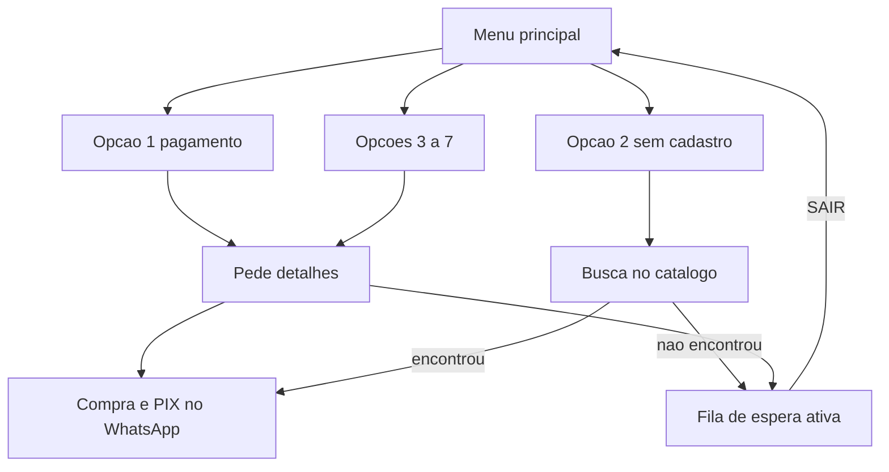

# MarketChat — Knowledge Base (Regras de Negócio)

Documento de referência para treinar assistentes e pessoas sobre o que o MarketChat **realmente faz**. Descreve capacidades, limites e fluxos operacionais. Não descreve implementação técnica.

---

## Visão Geral e Arquitetura

O MarketChat é um SaaS multi-tenant voltado a operadores de micromercados autônomos (lojas de autoatendimento em condomínios e pontos similares). Cada empresa cliente tem sua própria conta isolada, com mercados, catálogo, conversas e cobranças. O canal principal com o consumidor final é o WhatsApp: um bot conduz onboarding, menu de suporte, compra com PIX e, quando necessário, coloca a pessoa em espera para um atendente humano. O pagamento das vendas é feito via PIX (integração Asaas). Há um painel web para a equipe da empresa atender conversas, gerar cobranças, gerenciar produtos e mercados, configurar horário comercial do bot e pausar o bot globalmente. O WhatsApp é conectado por integração com provedor de API (Evolution). O produto **não** é um ERP de estoque, um CRM genérico nem um sistema de ponto de venda da maquininha física: a maquininha no local e o MarketChat são complementares — o bot cobre falhas de pagamento/cadastro e vendas pelo chat, enquanto o painel cobre atendimento e operação comercial.

---

## Modelos de Dados Core

### Empresa (conta)

Unidade de isolamento do SaaS. Agrupa mercados, moradores, produtos, conversas, assinatura do próprio MarketChat e configurações (incluindo a chave geral do bot e o cliente Asaas “Consumidor Final” usado em vendas avulsas). A cobrança da assinatura MarketChat é por mercados ativos; o acesso ao painel pode ser restringido conforme o status da assinatura (trial, ativa, atraso, suspensa, cancelada).

### Mercado / loja

Unidade física (em geral um ponto em condomínio): nome, endereço, ativo ou inativo. O morador pode ser vinculado a um mercado. O mercado também entra na lógica de preço da assinatura SaaS quando há valor negociado por loja.

### Morador / cliente

Pessoa que conversa pelo WhatsApp. Identificada principalmente pelo telefone (único por empresa, enquanto o cadastro não estiver anonimizado por LGPD). Possui nome (preenchido no onboarding), vínculo opcional a um mercado e flag de ativo. **Não há cadastro de CPF do morador no MarketChat.** Para fins de cobrança PIX pelo painel, um morador é considerado “identificado” quando tem **nome e mercado** preenchidos; caso contrário a venda pode seguir como avulsa (Consumidor Final da empresa). No checkout pelo bot, o sistema cria/usa um cliente de pagamento ligado ao telefone do morador (com documento técnico de configuração do ambiente, não com CPF informado pelo usuário).

### Catálogo de produtos

Produtos por empresa: nome, código interno (SKU), preço, aliases para busca, ativo/inativo. O bot e o painel buscam produtos ativos por nome (e aliases). Itens de pedido podem vir do catálogo ou ser linhas avulsas (nome e valor digitados pelo atendente). Não há módulo de inventário físico completo (quantidade em gôndola, reposição logística ERP): relatos de falta de estoque geram alerta operacional, não baixa de estoque automatizada.

### Sessão de conversa

Uma conversa ativa por telefone e empresa. Guarda o **estado do fluxo** (onboarding, menu, detalhes de suporte, busca de produto sem cadastro, fila humana, busca/quantidade/carrinho/foto de segurança, conversa livre), o carrinho em andamento quando houver, se o bot está ligado naquela conversa, e marcas de atividade / última interação humana. O histórico de mensagens (morador, bot, atendente) alimenta a central de atendimento do painel.

### Relacionamentos (visão de negócio)

A empresa possui mercados, moradores, produtos e sessões. O morador pode pertencer a um mercado. A sessão aponta para o telefone (e, na prática, para o morador correspondente) e pode ter um carrinho/pedido em curso. Pedidos e cobranças PIX ligam a venda ao Asaas e, quando aplicável, ao crédito financeiro interno da empresa.

---

## Máquina de Estados e Roteamento do Bot

### Entrada e menu principal

Após o onboarding (nome e condomínio/mercado, quando o fluxo exige), a conversa fica em modo livre. Uma saudação reconhecida abre o **menu principal de suporte**, com cumprimento personalizado e sete opções numeradas. O morador pode responder com o número (1 a 7) ou com palavras que indiquem o assunto (ex.: maquininha, geladeira, sem cadastro). Em vários pontos do fluxo, digitar **SAIR** reinicia ou volta ao menu, conforme o contexto.

**Opções do menu (rótulos exatos):**

1. Indisp. de pagamento ou queda sistema  
2. Produto sem cadastro  
3. Problema cobrança  
4. Problema geladeira  
5. Problema loja  
6. Problema com produto  
7. Outros assuntos  

### Opção 1 — Erro de pagamento / queda de sistema

1. O bot pede mais detalhes sobre o ocorrido.  
2. Ao receber o texto, trata o caso como **falha de pagamento**, não como fila genérica.  
3. Alerta o responsável da empresa (WhatsApp ao telefone da conta/admin) e registra notificação crítica no painel.  
4. Responde ao morador pedindo desculpas pela maquininha e **oferece comprar e pagar por PIX no próprio WhatsApp**, perguntando qual produto deseja.  
5. Abre o fluxo de **busca de produto / carrinho** (jornada de compra). **Não** coloca o morador na fila de atendimento humano por padrão.

### Opção 2 — Produto sem cadastro (contingência de caixa)

Objetivo: quando a maquininha rejeita um item “sem cadastro”, tentar reter a venda pelo catálogo do MarketChat antes de escalar para humano.

1. O bot pergunta qual produto apareceu como não cadastrado e pede nome ou marca para procurar no sistema e tentar gerar o pagamento pelo chat.  
2. **SAIR** nesse estado volta ao menu principal.  
3. **Se encontrar** no catálogo: envia uma mensagem com “Boa notícia”, lista numerada (até dez itens) com preço, pergunta se deseja adicionar ao carrinho e pagar por aqui, e segue o fluxo normal de seleção de produto / compra. **Não** entra na fila humana.  
4. **Se não encontrar:** notifica a equipe com o tema “Produto sem cadastro”, coloca a conversa em **aguardando atendimento humano** e envia mensagem específica dizendo que o produto não aparece no sistema, que a equipe foi avisada para cadastro/ajuste da maquininha, que um atendente assumirá em breve, e que o morador pode cancelar o chamado digitando SAIR. O bot permanece apto a tratar SAIR (fila de espera ativa).

### Opções 3 a 7 — Suporte e fila de espera ativa

1. O bot pede detalhes do ocorrido (mensagem padrão de coleta).  
2. Com o texto do morador, o sistema **reclassifica a intenção** (reclamação, manutenção, estoque, etc.). A opção do menu **não** define sozinha o tratamento interno (exceto a opção 1, já descrita).  
3. Quando a intenção indica reclamação, manutenção ou falta de estoque, disparam-se **alertas internos** (dono/painel) sem enviar ao morador as respostas longas típicas desses fluxos na conversa livre.  
4. Em todos os casos das opções 3–7, após os detalhes, a conversa entra em **aguardando atendimento humano** e o morador recebe a mensagem de fila: solicitação registrada, equipe notificada, atendente em instantes; se quiser nova compra ou cancelar o chamado, digite SAIR.

**Mecânica da fila de espera ativa:**

- O bot da conversa **permanece ligado** o suficiente para comandos limitados (em especial **SAIR**). Não é um “mudo total” por estar na fila.  
- Mensagens comuns (cumprimentos, texto livre) **não geram resposta automática** — o morador aguarda o humano no inbox.  
- **SAIR** reexibe o menu principal e abandona o chamado da fila.  
- Quando um atendente envia mensagem pelo painel, o bot daquela conversa é **pausado** e a sessão sai do estado de fila (volta ao modo livre/compra do ponto de vista de estado, com bot sob controle humano).

### Conversa livre e jornada de compra (fora do menu 1–7)

Na conversa livre, o bot também reconhece intenções de compra, reclamação, estoque, manutenção, saudação (que abre o menu), etc. A compra típica segue: busca de produto → escolha → quantidade → revisão do carrinho → **foto de segurança** dos produtos → geração do PIX → confirmação de pagamento. Há ainda fluxo de sugestão de produto ao catálogo, separado do menu de suporte.

### Alertas críticos

O sistema usa dois canais principais: WhatsApp ao responsável da empresa e notificações no painel.

**Qualidade alimentar (produto vencido / estragado):**  
Na conversa livre com reclamação de qualidade, o morador recebe orientação para separar o produto, indicação de que o lote foi bloqueado, que a gerência foi alertada e que haverá transferência humana, pedindo o valor pago para agilizar estorno; o bot pode ser **pausado** para o humano assumir. O responsável recebe alerta de qualidade alimentar.  
Quando o mesmo tipo de tema chega pelas **opções 3–7**, o morador vê prioritariamente a **mensagem de fila** (e SAIR); alertas internos ainda podem ocorrer, mas não se substitui a fila pela mensagem longa de qualidade da conversa livre.

**Estoque / ruptura:** relato gera resposta empática (na conversa livre), registro e aviso ao responsável para reposição. Não baixa estoque em sistema de inventário.

**Manutenção / infraestrutura (ex.: geladeira):** alerta ao responsável e, fora da fila do menu, mensagem padrão ao morador; pelo menu 3–7 segue o padrão de fila.

**Reclamações gerais:** alerta de reclamação ao responsável.

**Pagamento / maquininha / catálogo na conversa livre:** podem acelerar busca de produtos ou oferta de PIX, alinhado às tags de ocorrência do assistente.

---

## Módulo Financeiro (Asaas)

### Cobrança PIX gerada pelo atendente no chat

No painel, na conversa, o atendente pode abrir o modal de cobrança PIX: informar valor único ou lista de itens (com busca no catálogo ou linhas avulsas), descrição opcional, e gerar/enviar a cobrança. O sistema cria o pedido interno, registra o PIX no Asaas (vencimento no dia) e obtém o código copia e cola.

### Consumidor Final / cliente genérico

- **Morador identificado** (nome + mercado): a cobrança usa o cliente de pagamento nominal ligado ao morador.  
- **Morador não identificado** (falta nome ou mercado): a cobrança usa o cliente **Consumidor Final** da empresa no Asaas, montado com os dados da conta (incluindo CPF/CNPJ da empresa). A interface avisa que se trata de venda avulsa. A descrição da cobrança pode incluir o telefone para rastreio. Exige CPF/CNPJ válido da empresa na conta.

### Duas mensagens no WhatsApp

O envio ao morador é propositalmente em **duas mensagens separadas**:

1. Resumo do pedido, total, link de fatura se houver, e instrução para usar a mensagem seguinte.  
2. **Somente** o código PIX copia e cola (para facilitar a cópia no celular).

Após o envio pelo painel, o bot daquela conversa é pausado (handover implícito). Se a pessoa estava na fila humana, a sessão deixa o estado de fila.

### Checkout PIX pelo próprio bot (carrinho)

Difere do modal do painel: quem inicia é o morador no WhatsApp; os itens vêm do fluxo de catálogo; **é obrigatória a foto de segurança** antes de gerar o PIX; o cliente Asaas é o do morador (não o Consumidor Final da venda avulsa do painel); o envio do PIX pelo bot **não** pausa automaticamente o bot como o modal do atendente. As mensagens ao morador também separam instrução e código.

### Baixa via webhook

Quando o Asaas notifica pagamento confirmado do pedido: o pedido é concluído, o financeiro interno da venda é creditado, a sessão de compra é liberada e o morador recebe WhatsApp de confirmação (nome, valor, mercado / orientação de retirada conforme o fluxo). Em atraso ou cancelamento, o pedido é marcado adequadamente, a sessão é liberada e o morador pode ser orientado a refazer a compra. O mesmo canal de webhook também processa outros eventos Asaas da plataforma (ex.: assinatura SaaS), mas a baixa da venda do micromercado é o caminho descrito acima.

---

## Painel Administrativo / Configurações

### Central de atendimento (inbox)

Lista conversas com filtros (todas / bot ativo / atendimento humano), histórico da conversa (morador, bot, atendente), atualização periódica e recursos de leitura/notificação. O atendente envia mensagens pelo WhatsApp a partir do painel; isso registra a mensagem no histórico e **pausa o bot** daquela conversa.

### Handover manual

Interruptor por conversa para ligar ou desligar o bot. Enviar mensagem como humano ou enviar cobrança PIX pausa o bot. Se o bot estiver pausado e não houver nova interação humana por cerca de **duas horas**, o bot pode ser reativado automaticamente nessa conversa. A fila “aguardando atendimento humano” (vinda do menu de suporte ou de produto não encontrado) é independente do interruptor: nela o bot só responde de forma limitada (SAIR), até o humano assumir ou o morador sair.

### Geração de PIX pelo modal

Modal na conversa: valor ou itens, descrição opcional, total, confirmação com aviso de venda avulsa quando o cliente não está identificado, e ação de gerar e enviar as duas mensagens no WhatsApp.

### Grade de horários (horário comercial)

Em Configurações → Horário Comercial: por dia da semana, define se há expediente e a janela de horário. **Durante o expediente configurado, o bot não responde** (espera-se equipe humana). **Fora da janela** ou em dia marcado como folga, o bot responde. Se nenhuma grade estiver salva, o comportamento legado é bot sempre apto a responder (ainda sujeito à chave geral e ao handover por conversa).

### Chave geral de pausa do bot

Na mesma área de configurações, um interruptor mestre desliga o bot para **toda a conta**. Com a chave desligada, **nenhuma** resposta automática é enviada em nenhuma conversa; as mensagens do morador ainda entram no histórico/inbox para atendimento humano. Essa chave tem prioridade sobre horário comercial e sobre o bot “ligado” em conversas individuais.

### Outras configurações do painel

Também existem telas/seções para dados da conta (incluindo CPF/CNPJ da empresa), gestão de mercados, integrações (WhatsApp e recebimento PIX / subconta quando aplicável), privacidade LGPD e informações de plano/assinatura — sempre no escopo da operação do micromercado e da conta SaaS, sem transformar o produto em ERP genérico.

---

## Limites explícitos (anti-alucinação)

Ao descrever o MarketChat, **não** afirme que o sistema:

- cadastra ou exige **CPF do morador** no perfil do consumidor;  
- gerencia **estoque físico / inventário ERP** (contagem, reposição automática de gôndola);  
- coloca o morador em **fila humana** após a opção 1 de pagamento (o fluxo pivota para compra/PIX);  
- coloca em fila humana a opção 2 **quando o produto é encontrado** no catálogo;  
- envia o código PIX **misturado** na mesma mensagem do resumo (são duas mensagens);  
- responde automaticamente com a **chave geral do bot desligada**, ou **dentro** do horário de expediente configurado (com grade ativa);  
- substitui a maquininha física do ponto de venda ou opera como CRM/ERP completo.

O que o sistema faz está descrito nas seções anteriores: bot WhatsApp multi-tenant, menu de suporte 1–7 com retenção na opção 2 e fila ativa nas opções 3–7 (e na opção 2 sem match), cobranças PIX (bot e painel), Consumidor Final para vendas avulsas, e painel com handover, PIX, horário e pausa global.
