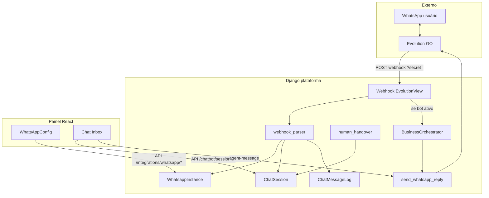

# Playbook: plataforma de bot WhatsApp (Evolution GO + Django + painel)

> Guia de **portabilidade** para reutilizar a camada de conexão e gerenciamento
> do MarketChat em **outros bots de atendimento**, sem carregar regras de
> micromercado (carrinho, Pix, estoque, menu de suporte, etc.).
>
> Complementa o guia técnico baixo nível:
> [`evolution-go-django-integration.md`](./evolution-go-django-integration.md).

Última revisão: julho/2026 — derivado da implementação do projeto `marketchat`.

---

## Sumário

1. [Propósito e escopo](#1-propósito-e-escopo)
2. [Arquitetura da plataforma](#2-arquitetura-da-plataforma)
3. [O que copiar vs o que deixar de fora](#3-o-que-copiar-vs-o-que-deixar-de-fora)
4. [Modelo de dados mínimo](#4-modelo-de-dados-mínimo)
5. [Backend: integração Evolution](#5-backend-integração-evolution)
6. [Backend: pipeline do webhook](#6-backend-pipeline-do-webhook)
7. [Backend: sessão, inbox e human handover](#7-backend-sessão-inbox-e-human-handover)
8. [Contrato do orchestrator de negócio](#8-contrato-do-orchestrator-de-negócio)
9. [Frontend: conexão WhatsApp](#9-frontend-conexão-whatsapp)
10. [Frontend: inbox de atendimento](#10-frontend-inbox-de-atendimento)
11. [Checklist de portabilidade](#11-checklist-de-portabilidade)
12. [Fora de escopo (domínio MarketChat)](#12-fora-de-escopo-domínio-marketchat)
13. [Referência rápida de arquivos](#13-referência-rápida-de-arquivos)

---

## 1. Propósito e escopo

Este playbook descreve o **skeleton de plataforma** para:

- conectar um número WhatsApp via **Evolution GO**;
- gerenciar a instância (QR, status, disconnect, restart) em um painel React;
- receber mensagens por webhook no Django;
- persistir histórico por conversa (inbox);
- pausar o bot e permitir atendimento humano (handover);
- plugar **qualquer domínio** (FAQ, tickets, CRM, agendamento…) no mesmo pipeline.

**Não** documenta aqui: compra via WhatsApp, Asaas/Pix, catálogo de produtos,
condomínios/markets, matriz de ocorrências de micromercado, billing SaaS.

A regra de ouro ao portar:

> O webhook e o painel **nunca** devem importar módulos de domínio
> (`sales`, `products`, `markets`). Eles chamam um **orchestrator plugável**.

No MarketChat atual o domínio ainda está misturado em
`apps/integrations/services/webhook_handlers.py` (`process_cart_flow`,
`classify_user_intent`, etc.). Ao criar um projeto novo, **desacople** desde o
dia 1 conforme a seção 8.

---

## 2. Arquitetura da plataforma



### Dois planos

| Plano | Responsabilidade |
|-------|------------------|
| **Plataforma** | Instância WhatsApp, webhook, sessão, log, handover, envio de texto/mídia, UI de conectar + inbox |
| **Domínio** | FSM própria, intents, IA, tickets, menus — implementado atrás do orchestrator |

### Fluxos críticos

1. **Inbound**: Evolution → webhook Django → parse → log sempre → (se bot ativo) orchestrator → reply opcional.
2. **Outbound bot**: domínio / plataforma chama `send_whatsapp_reply` → Evolution `POST /send/text`.
3. **Outbound agente**: painel `POST .../sessions/{id}/messages/` → envia no WhatsApp + `pause_bot`.
4. **Conexão**: painel provisiona → Evolution create/connect → polling QR → evento `CONNECTION`/`CONNECTED` atualiza status.

Detalhes de API do Evolution (create, connect, send, mídia E2E, armadilhas):
ver [`evolution-go-django-integration.md`](./evolution-go-django-integration.md).

---

## 3. O que copiar vs o que deixar de fora

### Copiar / adaptar (plataforma)

| Área | Origem no MarketChat |
|------|----------------------|
| Modelo de instância | `apps/integrations/models.py` → `WhatsappInstance` |
| Cliente HTTP | `apps/integrations/services/evolution_client.py` |
| Provisionamento / QR / recreate | `apps/integrations/services/provisioning.py` |
| Webhook view + parser + handlers de conexão | `views_webhook.py`, `webhook_parser.py`, partes de `webhook_handlers.py` |
| Envio de texto | `apps/residents/services/whatsapp_reply.py` (ou equivalente genérico) |
| Sessão + handover | campos `is_bot_active` / `last_human_interaction_at` + `human_handover.py` |
| Log de mensagens | `ChatMessageLog` + `chat_logging.py` |
| APIs painel WhatsApp | `apps/integrations/urls.py` + `views.py` |
| APIs inbox / toggle / agent | `apps/chatbot/urls.py` (rotas de sessions/logs) |
| Front conexão | `WhatsAppConfig.tsx` + `components/integrations/whatsapp/*` + `features/integrations/*` |
| Front inbox | `components/chatInbox/*` + `features/chatLogs/*` |
| Multi-tenant base | `Tenant` + `TenantAwareModel` + `tenant_scope` |

### Não copiar (domínio MarketChat)

- `apps/sales/**` (carrinho, menu, intents de estoque/reclamação)
- `apps/products/**`, `apps/markets/**`
- Estados FSM de compra (`PRODUCT_SEARCH`, `CART_REVIEW`, `AWAITING_PHOTO`, …)
- Billing Asaas, charge Pix no inbox
- Occurrence tags / `ALERTA_QUALIDADE` / matriz de suporte micromercado
- Onboarding de condomínio (`AWAITING_NAME` / `AWAITING_CONDO`) — a menos que o novo produto precise de cadastro similar
- Builder visual de fluxos (`ChatbotWorkflow`) — opcional; não é requisito da plataforma mínima

### Opcional (plataforma “avançada”)

- Chave mestre `Tenant.is_bot_active_global` e horário comercial (`bot_schedule`) — úteis em qualquer bot B2B
- Presence/typing no inbox
- Dedup de `message_id` via cache Redis
- Workflow visual React Flow — só se o produto novo for “low-code”

---

## 4. Modelo de dados mínimo

### 4.1 Tenant

Unidade de isolamento multi-tenant (empresa/cliente). No MarketChat:
`apps/tenants/models.py`.

Campos **úteis à plataforma** (mínimo sugerido):

- `id`, `name`, `slug`
- opcional: `is_bot_active_global` (desliga o bot para todo o tenant sem desconectar o WhatsApp)

### 4.2 WhatsappInstance

Uma instância por tenant no MVP (`uniq_whatsappinstance_tenant`).

Campos essenciais (ver modelo real em `apps/integrations/models.py`):

| Campo | Uso |
|-------|-----|
| `instance_name` | Nome lógico no Evolution |
| `instance_id` | UUID usado em delete remoto |
| `api_key` | Token da instância (header `apikey` nas rotas `/send/*`) |
| `webhook_url` / `webhook_secret` | URL com `?secret=` para autenticar o webhook |
| `connection_status` | `unknown` \| `connecting` \| `open` \| `close` |
| `pair_phone` | Opcional no connect (QR amarrado ao aparelho) |
| `profile_*`, `phone_number`, `platform` | Dashboard do painel |
| `disconnect_reason`, `last_webhook_at`, `is_active` | Operação / health |

### 4.3 ChatSession (conversa)

Uma sessão por `(tenant, phone_number)`.

**Campos de plataforma** (manter):

- `phone_number`, `state` (FSM **do seu domínio** — comece com `IDLE` apenas)
- `is_bot_active`, `last_human_interaction_at`
- `last_activity_at` (ordenação do inbox / inatividade)

**Campos de domínio MarketChat** (não portar):

- `active_cart`, `pending_product`, `last_discussed_product`
- estados de compra / menu de suporte

### 4.4 ChatMessageLog

Histórico da central de atendimento (`apps/chatbot/models.py`):

- `direction`: `INBOUND` \| `OUTBOUND` \| `AGENT`
- `message_text`, `message_kind` (`text` / `image` / `interactive`)
- `session` FK, `evolution_message_id` (dedup)
- FKs de domínio (`resident`, `market`, `cart`, `intent_type` rico) → no projeto novo, simplifique (`contact` genérico, `intent` string livre)

---

## 5. Backend: integração Evolution

### 5.1 Variáveis de ambiente

```python
EVOLUTION_API_BASE_URL = "http://localhost:8080"
EVOLUTION_GLOBAL_API_KEY = "<AUTHENTICATION_API_KEY do container>"
PUBLIC_WEBHOOK_BASE_URL = "https://seu-backend.exemplo.com"  # alcançável pelo Evolution
EVOLUTION_WEBHOOK_EVENTS = ["MESSAGE", "CONNECTION", "QRCODE"]
```

- Chave **global** ≠ `api_key` por instância.
- Se mudar `PUBLIC_WEBHOOK_BASE_URL`, reconfigure o webhook (re-provision / reconnect).

Compose mínimo, create/connect/send e armadilhas: doc Evolution citado acima.

### 5.2 Rotas HTTP da plataforma (Django)

Montadas em `config/urls.py` → `path("api/integrations/", ...)`.

| Método | Path | Função |
|--------|------|--------|
| GET | `/api/integrations/whatsapp/` | Estado + health do dashboard |
| POST | `/api/integrations/whatsapp/provision/` | Cria instância no Evolution + grava DB |
| GET | `/api/integrations/whatsapp/qrcode/` | Obtém/atualiza QR (base64/image) |
| GET | `/api/integrations/whatsapp/status/` | Refresh de status de conexão |
| POST | `/api/integrations/whatsapp/disconnect/` | Desconecta sessão |
| POST | `/api/integrations/whatsapp/restart/` | Restart / recreate quando sessão zumbi |
| POST | `/api/integrations/whatsapp/avatar/refresh/` | Atualiza foto de perfil |
| POST | `/api/integrations/webhooks/evolution/` | Webhook público (AllowAny, **sem throttle anon**) |

Auth das rotas de gerenciamento: usuário autenticado com permissão de
gerenciar integrações do tenant (`can_manage_integrations`).

### 5.3 Autenticação do webhook

O Evolution GO **não** envia headers customizados de forma confiável; o padrão
deste projeto é:

1. Resolver instância por `?secret=` (`webhook_secret`)
2. Fallback: header `apikey` = `WhatsappInstance.api_key`
3. Fallback: `instance_name` / `instance_id` no payload

Sempre responder rápido (`{"ok": true}`). Erros internos → 500 com log; payload
inválido → `ignored`.

**Importante:** desabilitar throttle anônimo nessa view. Rate limit global (ex.:
10/min) descarta mensagens reais sob carga de eventos de presença/conexão.

### 5.4 Envio de mensagens

Wrapper recomendado (padrão MarketChat):

```python
def send_whatsapp_reply(instance, phone, text, *, session=None, log_message=True):
    digits = "".join(c for c in phone if c.isdigit())
    EvolutionClient().send_text(
        instance_api_key=instance.api_key,
        number=digits,
        text=text,
    )
    if log_message:
        log_outbound(...)  # ChatMessageLog OUTBOUND
```

Normalizar número só com dígitos (DDI+DDD+número). Botões interativos no
Evolution GO exigem shape `{type, id, displayText}` — ver cliente.

---

## 6. Backend: pipeline do webhook

Ordem recomendada para um projeto **novo** (versão limpa do que
`handle_evolution_webhook` / `_handle_message` fazem hoje):

```text
1. parse_evolution_payload(body) → EvolutionWebhookEvent | None
2. Ignorar from_me e grupos (@g.us)
3. Resolver WhatsappInstance (secret / apikey / name)
4. Validar secret
5. Despachar por event_type:
   - CONNECTED / PAIRSUCCESS / CONNECTION → atualizar connection_status (+ avatar)
   - DISCONNECTED / LOGOUT → mark disconnected
   - QRCODE → status connecting
   - PRESENCE → typing indicator (opcional)
   - MESSAGE → pipeline abaixo
```

### Pipeline MESSAGE (plataforma)

```text
1. Dedup por evolution message_id (cache ~120s)
2. Gate opcional: tenant pode receber mensagens? (billing / bloqueio)
3. phone = jid_to_phone(remote_jid)
4. session = get_or_create_chat_session(tenant_id, phone)
5. touch last_activity_at
6. log_inbound(...)  # SEMPRE — mesmo com bot pausado
7. bot_should_reply =
      tenant.is_bot_active_global
      AND ensure_bot_active_or_timeout(session)
      AND (opcional) dentro do horário comercial
8. Se não bot_should_reply → return  # mensagem só no inbox
9. orchestrator.handle_inbound(instance, session, event) → bool
```

Pontos que o MarketChat ainda acopla ao domínio (substituir no fork):

- `process_cart_flow`, `run_chatbot_flow`, `classify_user_intent`
- download de foto de “segurança” do carrinho
- onboarding de residente/condomínio

### Eventos de conexão

Manter o mapeamento de estados (`open` / `close` / `connecting`) e
`disconnect_reason`. Logout permanente (“logged out”, “another device”, …)
pode exigir **recreate** da instância no Evolution (`recreate_evolution_instance`
em `provisioning.py`) — o painel deve oferecer “Reconectar” / “Reiniciar”.

---

## 7. Backend: sessão, inbox e human handover

### 7.1 Handover

Arquivo referência: `apps/chatbot/services/human_handover.py`.

| Função | Comportamento |
|--------|----------------|
| `pause_bot(session)` | `is_bot_active=False` + `last_human_interaction_at=now` |
| `resume_bot(session)` | `is_bot_active=True` |
| `toggle_bot(session, is_bot_active=...)` | pause ou resume |
| `ensure_bot_active_or_timeout(session)` | Se pausado e passou o timeout (2h), reativa; senão retorna se o bot deve processar |

Contrato no webhook: **sempre logar inbound**; só chamar o orchestrator se
`ensure_bot_active_or_timeout` (e gates globais) permitirem.

### 7.2 APIs de inbox / agente

| Método | Path | Função |
|--------|------|--------|
| GET | `/api/chatbot/sessions/` | Lista sessões do inbox (`bot_active`, `q`, `page`) |
| GET | `/api/chatbot/logs/conversation/?session_id=` | Mensagens da conversa (`after_id` para poll) |
| PATCH | `/api/chatbot/sessions/{id}/toggle-bot/` | Body `{ "is_bot_active": bool }` |
| POST | `/api/chatbot/sessions/{id}/messages/` | Body `{ "text": "..." }` — envia como agente + `pause_bot` |

Comportamento do agent-message (padrão desejável em qualquer bot):

1. Enviar texto via Evolution
2. `log_agent_outbound`
3. `pause_bot(session)`
4. Opcional: se a FSM tiver estado de fila (`WAITING_FOR_HUMAN`), transicionar
   para `IDLE` (`reason="agent_assumed"`) — domínio; a plataforma só precisa
   pausar o bot

### 7.3 Inbox query

`apps/chatbot/services/chat_inbox_query.py`: ordenar por `last_activity_at`,
filtrar por bot ativo/pausado, preview da última mensagem. No projeto novo,
troque labels de “morador” por “contato” se fizer sentido.

---

## 8. Contrato do orchestrator de negócio

Defina uma interface única e injete-a no webhook. Exemplo:

```python
# apps/bot_core/orchestrator.py
from typing import Protocol

class BusinessOrchestrator(Protocol):
    def handle_inbound(
        self,
        *,
        instance: "WhatsappInstance",
        session: "ChatSession",
        event: "EvolutionWebhookEvent",
    ) -> bool:
        """
        Processa a mensagem de domínio.
        Retorna True se a mensagem foi consumida (não precisa de fallback).
        Nunca deve cuidar de: auth webhook, dedup, log inbound, pause_bot.
        """
        ...
```

Implementações exemplo (fora do MarketChat):

- FAQ + LLM com tools
- Abertura de ticket em helpdesk
- Agendamento / confirmação de horário
- Menu numérico genérico + fila humana (`WAITING_FOR_HUMAN` + SAIR)

No MarketChat, o papel do orchestrator está espalhado entre
`process_cart_flow`, `route_idle_message`, `run_chatbot_flow` e onboarding.
Ao portar, **não** copie essa malha — reescreva um único entrypoint.

### FSM mínima sugerida (genérica)

```text
IDLE  →  (seu fluxo)  →  WAITING_FOR_HUMAN  →  (agente assume → IDLE, bot pausado)
              ↑____________ SAIR / cancelar ____________|
```

Estados de compra do MarketChat não fazem parte desta FSM genérica.

---

## 9. Frontend: conexão WhatsApp

### 9.1 Arquivos

| Peça | Path |
|------|------|
| Página / embed | `front-end/src/pages/admin/WhatsAppConfig.tsx` |
| API client | `front-end/src/features/integrations/api.ts` |
| Tipos dashboard | `front-end/src/features/integrations/types.ts` |
| UI | `components/integrations/whatsapp/*` (device card, health grid, status badge, actions, disconnect modal) |

### 9.2 UX do fluxo de conexão

1. `GET /whatsapp/` — se `!has_instance`, CTA “Conectar”
2. `POST /whatsapp/provision/` — cria instância
3. Polling `GET /whatsapp/qrcode/` + `GET /whatsapp/status/` a cada ~3s enquanto
   `connection_status === "connecting"` ou há `qrcode_image`
4. Quando `connected` / `connection_status === "open"` → parar poll, mostrar
   device card (nome, telefone, plataforma, avatar)
5. Ações: disconnect (modal), restart, refresh avatar
6. Se `needs_reconnect` / `session_expired` → CTA reconectar (pode ir a recreate)

Health grid tipicamente mostra: Evolution API, webhook (`last_webhook_at`),
status da sessão.

Permissão: só usuários com `can_manage_integrations` executam mutações; demais
veem estado read-only ou hint de acesso.

### 9.3 Tipos do dashboard (contrato FE ↔ BE)

Campos usados pelo front (`WhatsappIntegrationState`):

- `has_instance`, `instance_name`, `connection_status`, `connected`, `is_active`
- `qrcode_image`, `pair_phone`
- `profile_name`, `profile_picture_url`, `phone_number`, `platform`
- `disconnect_reason`, `session_expired`, `was_connected`, `needs_reconnect`
- `evolution_api_status`, `webhook_status`
- `can_manage_integrations`

Mantenha esse contrato estável se quiser reaproveitar os componentes React
quase sem mudança.

---

## 10. Frontend: inbox de atendimento

### 10.1 Arquivos

| Peça | Path |
|------|------|
| Lista de sessões | `components/chatInbox/InboxSessionList.tsx` |
| Painel da conversa | `components/chatInbox/InboxChatPane.tsx` |
| Tabs / filtros | `InboxTabs.tsx` |
| API | `features/chatLogs/api.ts` (`fetchInboxSessions`, `fetchConversation`, `toggleSessionBot`, `sendAgentMessage`) |

### 10.2 Comportamentos essenciais

- Listar conversas com filtro bot ativo / pausado e busca
- Abrir conversa e fazer poll incremental (`after_id`)
- Toggle “Bot ativo” → `PATCH toggle-bot`
- Enviar mensagem do atendente → `POST messages` (pausa o bot automaticamente)
- Indicador de digitação (se presence estiver ligado no backend)

### 10.3 O que remover ao portar

- Modais de cobrança Pix / combobox de produto
- Badges de intent específicos de micromercado
- Qualquer CTA que chame `/api/sales/` ou `/api/payments/`

O inbox mínimo é: **lista + thread + toggle bot + composer do agente**.

---

## 11. Checklist de portabilidade

Use esta lista ao criar um repositório novo a partir deste código.

### Infra

- [ ] Subir Evolution GO (Docker) com `AUTHENTICATION_API_KEY`
- [ ] Configurar `EVOLUTION_*` e `PUBLIC_WEBHOOK_BASE_URL` alcançável pelo container
- [ ] Postgres/Redis (dedup + cache) conforme necessidade

### Backend núcleo

- [ ] Copiar/adaptar `WhatsappInstance` + migrations enxutas
- [ ] Copiar `EvolutionClient` + `provisioning` + views/urls de integrations
- [ ] Webhook view sem throttle + parser de eventos
- [ ] `ChatSession` mínimo + `ChatMessageLog` mínimo
- [ ] `human_handover` + endpoints toggle/agent
- [ ] `send_whatsapp_reply` + logging inbound/outbound/agent
- [ ] Implementar **um** `BusinessOrchestrator` (mesmo que só ecoe “recebido”)
- [ ] Garantir: log inbound sempre; orchestrator só se bot ativo

### Frontend núcleo

- [ ] Tela WhatsAppConfig + API `features/integrations`
- [ ] Inbox mínimo + API sessions/conversation/toggle/agent
- [ ] Auth JWT/session alinhada ao Django + escopo de tenant

### Qualidade

- [ ] Testes: provision mockado, webhook secret, pause/resume, agent-message pausa bot
- [ ] Teste de regressão: throttle não bloqueia webhook
- [ ] Documentar no README do projeto novo o link para este playbook + doc Evolution

### Desacoplamento

- [ ] Zero imports de `sales` / `products` / `markets` no webhook
- [ ] FSM de domínio isolada do módulo `integrations`

---

## 12. Fora de escopo (domínio MarketChat)

Não faça parte do skeleton de plataforma:

| Módulo / conceito | Motivo |
|-------------------|--------|
| Carrinho, checkout, foto de comprovante | E-commerce micromercado |
| Menu suporte opções 1–7 / `WAITING_FOR_HUMAN` de suporte | Copy e fluxos de produto |
| Asaas, Pix no chat, subcontas | Billing específico |
| Products / stock / aliases de busca | Catálogo |
| Markets / residents onboarding condo | Cadastro geográfico do produto |
| Occurrence tags (`ALERTA_QUALIDADE`, …) | Matriz de suporte MarketChat |
| Analytics de conversão de venda | Métricas de domínio |
| GTM / funil de marketing SaaS | Aquisição MarketChat |

Esses itens podem existir **no produto final**, mas como apps atrás do
orchestrator — não como dependências da camada de conexão.

---

## 13. Referência rápida de arquivos

### Backend plataforma

```
apps/integrations/
  models.py                          # WhatsappInstance
  urls.py / urls_webhooks.py
  views.py / views_webhook.py / views_avatar.py
  services/evolution_client.py
  services/provisioning.py
  services/webhook_parser.py
  services/webhook_handlers.py       # limpar domínio ao portar
  services/instance_dashboard.py
  services/instance_lookup.py
  services/profile_sync.py
  services/restart.py
  management/commands/resync_evolution_webhooks.py

apps/chatbot/
  models.py                          # ChatMessageLog (+ workflows opcional)
  urls.py                            # sessions, logs, toggle, agent
  services/human_handover.py
  services/chat_logging.py
  services/chat_inbox_query.py
  views_handover.py / views_inbox.py / views_chat_logs.py

apps/residents/
  models.py                          # ChatSession (extrair campos de domínio)
  services/whatsapp_reply.py

apps/tenants/
  models.py                          # Tenant, TenantAwareModel
  context.py                         # tenant_scope

docs/evolution-go-django-integration.md
docs/whatsapp-bot-platform-playbook.md   # este arquivo
```

### Frontend plataforma

```
front-end/src/pages/admin/WhatsAppConfig.tsx
front-end/src/features/integrations/{api,types}.ts
front-end/src/components/integrations/whatsapp/*
front-end/src/components/chatInbox/*
front-end/src/features/chatLogs/{api,types}.ts
```

---

## Próximos passos sugeridos num projeto novo

1. Criar repo Django + React com multi-tenant mínimo.
2. Portar `integrations` + webhook + `send_text` até conseguir QR e eco de mensagem.
3. Portar `ChatSession`/`ChatMessageLog` + inbox + handover.
4. Implementar o primeiro orchestrator de domínio (sem UI de venda).
5. Só então adicionar features de negócio específicas do produto.

Em caso de dúvida sobre payloads Evolution, QR ou mídia E2E, use sempre o
guia irmão [`evolution-go-django-integration.md`](./evolution-go-django-integration.md)
como fonte de verdade técnica do gateway.
